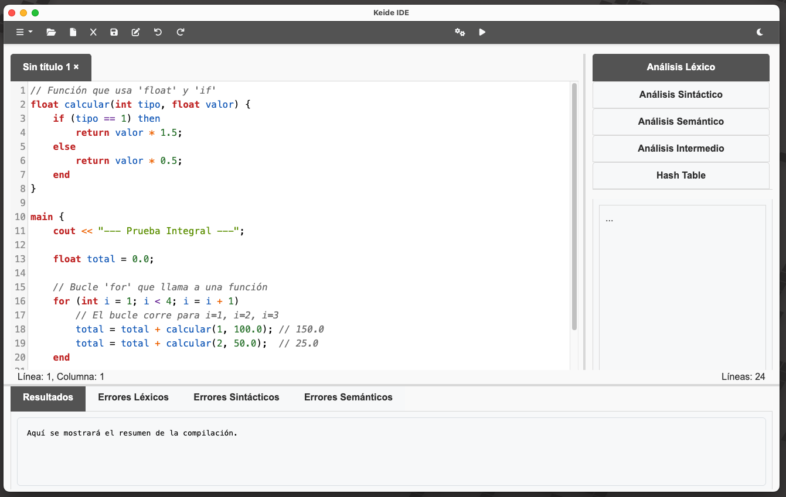
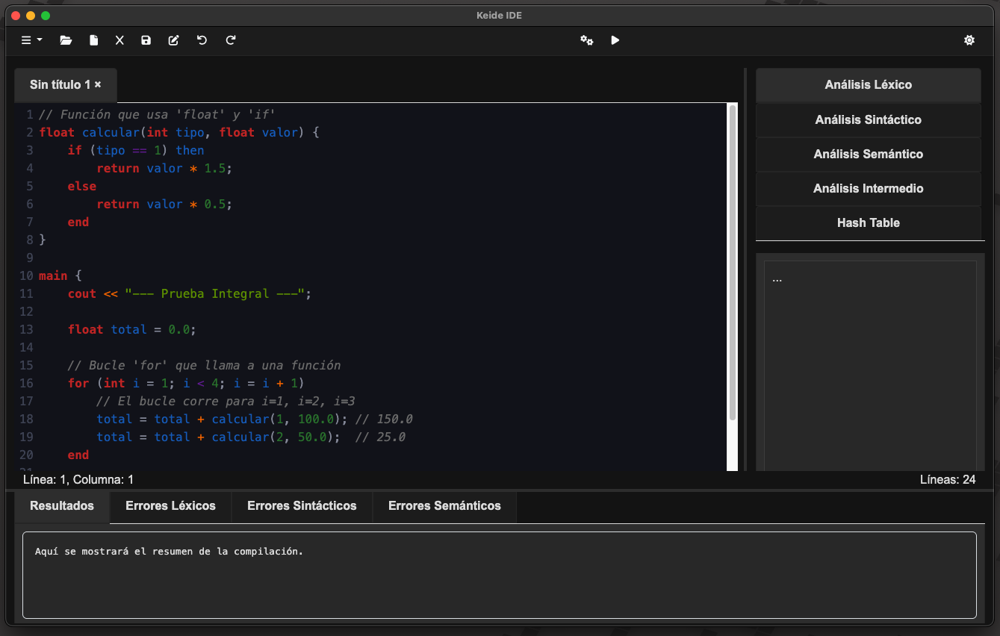
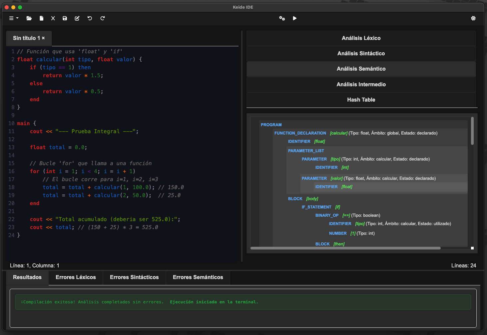
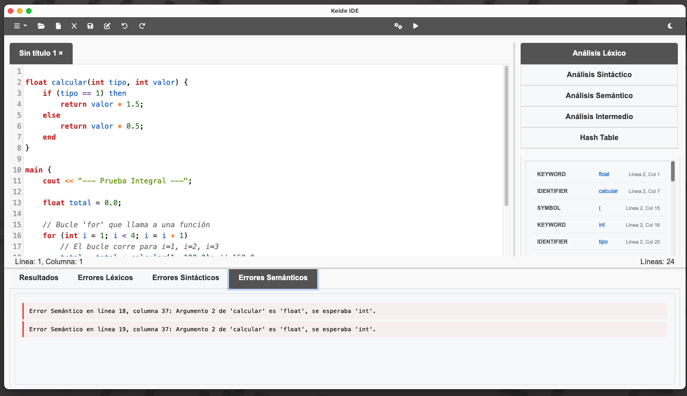

# Keide IDE 🚀

Keide IDE es un entorno de desarrollo integrado (IDE) sencillo y personalizable, diseñado para facilitar la escritura y compilación de código. Este proyecto está construido con **Electron**, **Python** y tecnologías web como **HTML**, **CSS** y **JavaScript**.

---

## Vistazo a la Interfaz 🖥️





| Paneles de Análisis | Detección de Errores |
| :---: | :---: |
|  |  |

---

## Instalación 🛠️

Sigue estos pasos para instalar y ejecutar Keide IDE en tu máquina:

1.  **Clona el repositorio**:
    ```bash
    git clone [https://github.com/diegorup/keide-ide.git](https://github.com/diegorup/keide-ide.git)
    cd keide-ide
    ```

2.  **Instala dependencias**:
    ```bash
    npm install
    ```

3.  **Ejecuta la aplicación**:
    ```bash
    npm start
    ```

---

## Stack Tecnológico y Estructura del Proyecto

Para entender cómo funciona Keide IDE, aquí tienes un desglose de las herramientas que utiliza y cómo está organizado el código.

## Stack Tecnológico 🛠️

* **Framework Principal:** **Electron**
    * Es el núcleo de la aplicación; permite la creación de una aplicación de escritorio nativa multiplataforma utilizando tecnologías web (HTML, CSS, JS).
* **Proceso Principal (Backend de UI):** **Node.js**
    * Gestiona el ciclo de vida de la aplicación, la creación de ventanas (`BrowserWindow`), la interacción con el sistema operativo (diálogos de archivos) y la orquestación de procesos secundarios.
    * Emplea el módulo `child_process` de Node.js para invocar el compilador de Python de forma asíncrona.
* **Proceso de Renderer (Frontend):** **HTML5**, **CSS3** y **JavaScript (ES6+)**
    * Comprende la interfaz de usuario renderizada dentro de una ventana de Chromium, gestionando la interacción directa con el usuario.
* **Librerías Frontend:**
    * **Bootstrap 5:** Framework CSS para la maquetación y diseño de componentes de la interfaz de usuario (UI).
    * **CodeMirror 5:** Componente de editor de texto avanzado que proporciona resaltado de sintaxis, numeración de líneas y capacidades de edición de código.
* **Núcleo del Compilador:** **Python 3**
    * Lenguaje principal para la implementación del *frontend* del compilador (análisis léxico, sintáctico y semántico) y la generación de código intermedio.
* **Generación de Código IR:** **`llvmlite` (Python)**
    * Librería *binding* de Python utilizada para construir programáticamente el Código Intermedio (IR) de LLVM a partir del AST validado.
* **Toolchain de Backend:** **LLVM (clang, opt, llc)**
    * El sistema depende de un *toolchain* de LLVM instalado en el sistema anfitrión. `compilador.py` invoca estas herramientas (`opt`, `llc`, `clang`) para la optimización, compilación y enlace del IR.

---

### Arquitectura de Compilación: El Rol de `llvmlite` y LLVM

Para comprender el proceso de generación de código, es fundamental diferenciar entre **`llvmlite`** (la librería de Python) y **`LLVM`** (el *toolchain* de compilación del sistema). Nuestro compilador ejecuta este proceso en dos etapas principales:


#### Etapa 1: Generación de IR (Frontend del Compilador)

Esta etapa es gestionada por `generador_llvm.py` y utiliza la librería `llvmlite`.

1.  **Rol de `llvmlite`:** Actúa como un *binding* de Python para la API de construcción de IR de LLVM. No compila código, sino que provee las herramientas programáticas (`ir.Module`, `ir.IRBuilder`) para construir un módulo de LLVM IR instrucción por instrucción.

2.  **Proceso de Traducción (AST a IR):**
    * `visit_declaration` invoca a `self.entry_builder.alloca(ir.IntType(32), name="x")`, lo que genera la instrucción de reserva de espacio en pila `%x = alloca i32` en el módulo IR.
    * `visit_binary_op` (para `+`) invoca a `self.builder.add(val_a, val_b)`, generando la instrucción aritmética `%add = add i32 %0, %1`.
    * `visit_output_statement` (`cout`) invoca a `self.builder.call(self.printf, ...)`, generando la instrucción `call @printf(...)` para una función externa.

**Salida de la Etapa 1:** Un archivo de texto (`programa.ll`) que contiene la representación intermedia (IR) de LLVM. Este IR es una descripción abstracta, estáticamente tipada y de bajo nivel del programa.

#### Etapa 2: Compilación y Enlace (Backend del Compilador)

Esta etapa es orquestada por `compilador.py` (función `run_llvm_compiler`) e invoca las herramientas del *toolchain* de LLVM instaladas en el sistema anfitrión mediante `subprocess`.

1.  **Optimización (`opt`):**
    * **Comando:** `opt -O2 programa.ll -o programa_opt.ll`
    * Se invoca al optimizador de LLVM. Lee el IR generado, aplica pases de optimización (ej. eliminación de código muerto, *inlining* de funciones) y produce un IR optimizado (`.ll`).

2.  **Compilación (`llc`):**
    * **Comando:** `llc programa_opt.ll -o programa.s`
    * Se invoca `llc` (LLVM Static Compiler). Este traduce el IR (independiente de la plataforma) a código ensamblador nativo (`.s`) específico de la arquitectura del sistema anfitrión (x86_64, ARM64, etc.).

3.  **Enlace (`clang`):**
    * **Comando:** `clang programa.s -o programa`
    * Se utiliza un enlazador (como `clang`) para dos tareas finales:
        1.  Ensamblar el código (`.s`) en un archivo objeto (`.o`).
        2.  **Enlazar** el archivo objeto con la Librería Estándar de C (`libc`).

Este enlace es el paso crucial donde las funciones externas declaradas en el IR (como `printf` y `scanf`) se resuelven contra sus implementaciones reales en `libc`.

**Salida de la Etapa 2:** Un archivo binario (`programa`) ejecutable nativo.

### Estructura del Código 📁

El proyecto está organizado en tres capas principales, siguiendo el patrón de diseño de Electron:

````

keide-ide-implementacion-llvm/
├── .gitignore
├── package.json          \# Define dependencias de Node.js y scripts
├── README.md             \# ¡Este archivo\!
│
├── main/                 \# 1. Lógica del Proceso Principal (Node.js)
│   ├── main.js           \# Punto de entrada principal de Electron
│   ├── preload.js        \# Script seguro para conectar 'main' y 'renderer'
│   └── modules/
│       └── python-handler.js \# Maneja la ejecución del script de Python
│
├── renderer/             \# 2. Lógica del Proceso de Renderer (UI - Frontend)
│   ├── index.html        \# Estructura principal de la UI
│   ├── css/
│   │   └── styles.css    \# Estilos personalizados
│   └── js/
│       ├── renderer.js   \# Lógica de la UI (botones, editor CodeMirror)
│       └── compile.js    \# Lógica para llamar al compilador y mostrar resultados
│
├── compiler/             \# 3. Lógica del Compilador (Python)
│   ├── compilador.py     \# Orquestador principal del compilador (recibe el código)
│   ├── analizador\_lexico.py
│   ├── analizador\_sintactico.py
│   ├── analizador\_semantico.py
│   ├── tabla\_hash.py
│   └── generador\_llvm.py \# Generador de código LLVM IR
│
└── test/                 \# Pruebas para el compilador
├── pruebas-Correctas.txt
└── pruebas-Errores.txt

````

---

## Características del Lenguaje 📜

El compilador de Keide IDE soporta un lenguaje de programación imperativo, tipado estáticamente y con una sintaxis inspirada en C++ y Pascal. A continuación se detallan sus características principales.

-----

### Tipos de Datos

El lenguaje maneja tres tipos de datos primitivos:

* **`int`**: Para números enteros (ej. `10`, `-5`, `1000`).
* **`float`**: Para números de punto flotante (ej. `3.14`, `-0.5`, `100.0`).
* **`string`**: Para cadenas de texto (ej. `"hola mundo"`, `"Keide IDE"`).

-----

### Variables y Ámbito

Las variables deben ser declaradas antes de su uso. El compilador soporta múltiples ámbitos (scopes).

* **Declaración Global**: Las variables declaradas fuera de cualquier función son globales.
    ```c
    int version = 1;
    string status = "OK";
    ```
* **Declaración Local**: Las variables declaradas dentro de una función (incluyendo `main`) son locales a esa función.
    ```c
    main {
        int score = 100;
    }
    ```
* **Inicialización**: Se puede asignar un valor a una variable en la misma línea de su declaración.
    ```c
    float health = 100.0;
    ```
* **Sombreado (Shadowing)**: Es posible declarar una variable local con el mismo nombre que una global. La variable local tendrá prioridad dentro de su ámbito.

-----

### Estructuras de Control

#### Condicionales

Se utiliza la estructura `if-then-else-end`. El bloque `else` es opcional. La condición debe ir entre paréntesis.

```c
if (score > 100 && status == "OK") then
    cout << "Nivel superado";
else
    cout << "Sigue intentando";
end
````

#### Bucles

  * **`while`**: Se ejecuta mientras la condición sea verdadera.
    ```c
    int i = 5;
    while (i > 0)
        cout << i;
        i = i - 1;
    end
    ```
  * **`do-until`**: Se ejecuta al menos una vez y continúa hasta que la condición sea verdadera.
    ```c
    int x = 0;
    do
        x = x + 1;
    until (x == 10);
    ```

-----

### Operadores

| Tipo | Operadores | Descripción |
| :--- | :--- | :--- |
| **Aritméticos** | `+`, `-`, `*`, `/`, `%` | Realizan operaciones matemáticas. El `+` también concatena strings. |
| **Relacionales**| `==`, `!=`, `<`, `>`, `<=`, `>=` | Comparan valores y devuelven un resultado booleano. |
| **Lógicos** | `&&` (Y), `||` (O) | Combinan expresiones booleanas. |
| **Asignación** | `=` | Asigna un valor a una variable. |

-----

### Funciones

Se pueden declarar funciones personalizadas con tipo de retorno y parámetros. Las variables declaradas dentro de una función son locales a ella.

El compilador realiza un **análisis semántico completo** de las funciones, incluyendo:
* **Validación de `return`**: Comprueba que el tipo de dato retornado coincida con la firma de la función.
* **Validación de Llamadas**: Comprueba que al llamar una función, el número de argumentos (aridad) y el tipo de cada argumento coinciden con la declaración de la función.

```c
// Declaración de una función con parámetros y retorno
int add(int a, int b) {
    int result = a + b;
    return result;
}

main {
    // Llamada a la función
    int sum = add(10, 5);
    
    // Esto generaría un error semántico:
    // int error_call = add(10, "hola");
    
    cout << sum; // Imprime 15
}
```

-----

### Entrada y Salida

El lenguaje incluye comandos básicos para interactuar con la consola.

  * **Salida (`cout`)**: Imprime texto o el valor de una variable en la consola.
    ```c
    cout << "Hola, " + player_name;
    ```
  * **Entrada (`cin`)**: Lee un valor desde la consola y lo asigna a una variable.
    ```c
    int edad;
    cin >> edad;
    ```

-----

### Limitaciones Actuales ⚠️

Es importante tener en cuenta las características que **no** están implementadas en la versión actual del compilador:

  * No se pueden declarar `arreglos (arrays)` ni `estructuras (structs)`.
  
-----

## Arquitectura del Compilador

El compilador de Keide IDE es un proyecto que implementa la cadena de compilación completa, desde el código fuente de alto nivel hasta un ejecutable nativo. Este proceso se divide en varias fases bien definidas, cada una manejada por un módulo específico dentro del directorio `compiler/`.

A continuación, se detalla cada fase del proceso de compilación.

### 1\. Fase 1: Análisis Léxico

  * **Módulo:** `analizador_lexico.py`
  * **Librería Clave:** `re` (Expresiones Regulares de Python)

Esta fase, también conocida como *scanning*, es la puerta de entrada del compilador. Su única responsabilidad es leer el código fuente como una cadena de texto plano y convertirlo en una secuencia de "tokens".

  * **Funcionamiento:**
    1.  Se define una lista de **patrones de expresiones regulares** en `LexicalAnalyzer.patterns`. Cada patrón está asociado a un `TokenType` (ej. `NUMBER`, `IDENTIFIER`, `KEYWORD`).
    2.  El analizador itera sobre el código de entrada, intentando hacer coincidir estos patrones.
    3.  Cuando encuentra una coincidencia (ej. `if`, `10.5`, `mi_variable`), genera un objeto `Token` que almacena el tipo, el valor (lexema), el número de línea y la columna.
    4.  Maneja casos especiales como comentarios (descartándolos), espacios en blanco y errores (ej. cadenas sin cerrar, caracteres no reconocidos), que se reportan como tokens de tipo `ERROR`.

El resultado de esta fase es una lista plana de `Token` objects, que se pasa al analizador sintáctico.

### 2\. Fase 2: Análisis Sintáctico

  * **Módulo:** `analizador_sintactico.py`
  * **Librería Clave:** Ninguna (Parser por Descenso Recursivo manual)

Esta fase, conocida como *parsing*, toma la secuencia de tokens de la fase léxica y verifica si siguen la **gramática** del lenguaje. Su objetivo es construir una estructura de datos jerárquica que represente la estructura lógica del código.

  * **Funcionamiento:**
    1.  Se implementa un **Parser por Descenso Recursivo**. Cada función (ej. `program()`, `statement()`, `expression()`) corresponde a una regla de la gramática del lenguaje.
    2.  Las funciones se llaman recursivamente para parsear la entrada. Por ejemplo, `statement()` puede llamar a `if_statement()`, que a su vez llama a `expression()`, y `expression()` llama a `term()`, `factor()`, etc.
    3.  A medida que el parser reconoce estas estructuras, construye un **Árbol de Sintaxis Abstracta (AST)**.
  * **Salida:** El nodo raíz de un `ASTNode`. Cada `ASTNode` tiene un `type` (ej. `BINARY_OP`, `IF_STATEMENT`), un `value` (ej. `+`, `if`) y una lista de `children` (los operandos, la condición, el cuerpo del `if`, etc.).
  * **Manejo de Errores:** Si el parser encuentra un token que no espera (ej. un `if` sin `then`), reporta un `SyntaxError` y detiene el proceso de compilación.

### 3\. Fase 3: Análisis Semántico

  * **Módulo:** `analizador_semantico.py`
  * **Librería Clave:** Ninguna (Lógica de Árbol y Tabla de Símbolos manual)

Una vez que tenemos un AST sintácticamente correcto, esta fase lo recorre para verificar que el código "tenga sentido". Responde preguntas como: "¿Esta variable fue declarada?" o "¿Estás intentando sumar un número a un *string*?".

Esta fase utiliza una **Tabla de Símbolos** (`SymbolTable`) como su principal herramienta de trabajo.

  * **Funcionamiento (Patrón Visitante):**
    1.  El `SemanticAnalyzer` recorre el AST usando el patrón *Visitor* (métodos `visit_...` para cada `ASTNodeType`).
    2.  **Gestión de Ámbito (Scope):** La `SymbolTable` mantiene una pila de ámbitos (`scope stack`). Al entrar en una función (`visit_function_declaration`) o bloque (`visit_if_statement`), se llama a `symbol_table.enter_scope()`. Al salir, se llama a `symbol_table.exit_scope()`.
    3.  **Verificación de Declaraciones:**
          * **Definición:** Cuando se visita `visit_declaration`, se añade la variable al ámbito actual usando `symbol_table.define()`. Si ya existe, se reporta un error de "redeclaración".
          * **Búsqueda:** Cuando se visita `visit_identifier`, se busca la variable con `symbol_table.lookup()`, que revisa la pila desde el ámbito actual hacia el global. Si no se encuentra, se reporta un error de "variable no declarada".
    4.  **Comprobación de Tipos (Type Checking):**
          * En nodos como `visit_binary_op`, se comprueba el tipo de los hijos (recursivamente). Se valida si el operador (`+`, `*`, `==`) es válido para esos tipos.
          * En `visit_assignment`, se compara el tipo de la variable (de la `SymbolTable`) con el tipo de la expresión.
          * En `visit_function_call`, se valida la *aridad* (número de argumentos) y los tipos de los argumentos contra la firma de la función almacenada en la `SymbolTable`.
  * **Salida:** El AST original es **anotado** durante este proceso (los nodos se actualizan con su `data_type` y `scope`) y se genera una lista de errores semánticos.

### 4\. Fase 4: Generación de Código Intermedio (LLVM IR)

  * **Módulo:** `generador_llvm.py`
  * **Librería Clave:** `llvmlite`

Esta es la primera fase del *backend*. Toma el AST, ahora semánticamente validado y anotado, y lo traduce a un lenguaje de ensamblador de bajo nivel, independiente de la plataforma, llamado **LLVM Intermediate Representation (IR)**.

Aquí es donde `llvmlite` entra en juego de forma crucial.

#### El Rol Detallado de `llvmlite`

`llvmlite` es una librería de Python que actúa como un *binding* (interfaz) para el API de construcción de IR de LLVM. **No** compila código Python a LLVM; permite a un programa Python *construir* programáticamente un módulo de LLVM IR.

Nuestro `CodeGenerator` (en `generador_llvm.py`) utiliza `llvmlite` de la siguiente manera:

1.  **Inicialización (`__init__`)**:

      * **`llvmlite.ir`**: Se importa el constructor de IR.
      * `self.module = ir.Module(name="mi_programa")`: Se crea el contenedor principal de LLVM. Todo el código (funciones, globales) vivirá dentro de este módulo.
      * `self.module.triple = llvm.get_default_triple()`: Se usa `llvmlite.binding` para establecer la arquitectura de destino (ej. "x86\_64-apple-darwin"), asegurando que el código generado sea compatible con la máquina actual.
      * **Declaración de Funciones Externas:** Se declaran las firmas de funciones de la librería estándar de C que usaremos, como `printf` y `scanf`. `llvmlite` nos permite definir sus tipos (`ir.FunctionType`) y luego declararlas (`ir.Function(self.module, ...)`). Así es como `cout` y `cin` se implementan.
      * **Variables Globales:** Se crean constantes globales para las cadenas de formato (ej. `"%d\n"`, `"%f\n"`) usando `ir.GlobalVariable`.

2.  **Construcción de Funciones (`visit_function_declaration`, `visit_main`)**:

      * **Tipos:** Se mapean los tipos del lenguaje (ej. 'int') a tipos LLVM (`ir.IntType(32)`, `ir.FloatType()`).
      * **Bloques Básicos:** Cada función en LLVM consiste en `Basic Blocks`. Se crea un bloque `entry` y un bloque `body` con `func.append_basic_block()`.
      * **Constructor de IR (`ir.IRBuilder`):** Esta es la herramienta principal. `self.builder = ir.IRBuilder(body_block)` crea un "cursor" que inserta instrucciones en el bloque `body`.
      * **Optimización de `alloca`:** Todas las variables locales se declaran al inicio de la función en el bloque `entry` usando `entry_builder.alloca()`. `alloca` reserva espacio en el *stack* de la función. Esto es un requisito de LLVM para optimizaciones (`mem2reg`).
      * **Almacenamiento:** Las asignaciones y el almacenamiento de parámetros en variables se realizan con `self.builder.store(value, ptr)`.

3.  **Traducción de Expresiones (`visit_binary_op`, `visit_number`)**:

      * Los ASTNodes se convierten en instrucciones de LLVM.
      * `ASTNodeType.NUMBER` (ej. `10`) se convierte en `ir.Constant(ir.IntType(32), 10)`.
      * `ASTNodeType.BINARY_OP` (ej. `a + b`) se traduce a:
          * `self.builder.load(ptr_a)` (Cargar valor de 'a')
          * `self.builder.load(ptr_b)` (Cargar valor de 'b')
          * `self.builder.add(val_a, val_b)` (Si son enteros) o `self.builder.fadd(val_a, val_b)` (Si son flotantes).
      * **Conversión de Tipos:** `llvmlite` es de tipado estricto. Si se suma un `int` y un `float`, primero debemos convertir el `int` a `float` usando `self.builder.sitofp()` (Sign-extend Integer To Floating Point).
      * **Comparaciones:** Los operadores `==`, `<`, `>` se traducen a `self.builder.icmp_signed()` (Integer) o `self.builder.fcmp_ordered()` (Float).

4.  **Traducción de Control de Flujo (`visit_if_statement`, `visit_while_statement`)**:

      * Esto demuestra el poder de LLVM. Un `if` no es una instrucción, es un conjunto de bloques y saltos.
      * `visit_if_statement` crea tres nuevos bloques: `then_block`, `else_block`, `endif_block`.
      * Genera un salto condicional: `self.builder.cbranch(condition_bool, then_block, else_block)`.
      * Al final de `then_block` y `else_block`, genera saltos incondicionales: `self.builder.branch(endif_block)`.
      * El `builder` se reposiciona (`self.builder.position_at_start(then_block)`) para generar el código dentro del bloque correspondiente.

5.  **Llamadas a Funciones (`visit_function_call`, `visit_output_statement`)**:

      * `visit_output_statement` (nuestro `cout`) es un gran ejemplo.
      * Primero, obtiene un puntero a la cadena de formato global (ej. `"%d\n"`) usando `self.builder.gep()` (Get Element Pointer).
      * Luego, genera la instrucción `self.builder.call(self.printf, [gep_ptr, value_to_print])`.

6.  **Verificación (`generate` en `CodeGenerator`)**:

      * Una vez que el AST ha sido recorrido, `str(self.module)` convierte el módulo LLVM en memoria a su representación textual (el código `.ll`).
      * `llvmlite.binding` se usa de nuevo para `llvm.parse_assembly(module_str)` y, lo más importante, `llvm_module.verify()`.
      * `verify()` le pide a LLVM que compruebe la *corrección semántica* del IR generado (ej. que los tipos coincidan en todas las operaciones, que todos los bloques terminen con una instrucción terminadora como `ret` o `br`). Si esto falla, el error está en nuestro `generador_llvm.py`.

### 5\. Fase 5: Compilación de Backend y Enlace

  * **Módulo:** `compilador.py` (función `run_llvm_compiler`)
  * **Librería Clave:** `subprocess` (para llamar a herramientas de LLVM)

El `generador_llvm.py` solo produce un archivo de texto `.ll`. Para crear un ejecutable, necesitamos las herramientas de compilación reales de LLVM, que se invocan desde Python usando `subprocess`.

1.  **Optimización:**

      * `opt -O2 programa.ll -o programa_opt.ll`
      * Se invoca a `opt`, el **optimizador** de LLVM. Lee nuestro IR y aplica docenas de pases de optimización (ej. eliminación de código muerto, desenrollado de bucles) para hacerlo más rápido.

2.  **Compilación a Ensamblador:**

      * `llc programa_opt.ll -o programa.s`
      * Se invoca a `llc`, el **LLVM Static Compiler**. Este es el verdadero *backend* que traduce el LLVM IR (que es independiente de la plataforma) a código ensamblador específico de la arquitectura (ej. x86-64, ARM).

3.  **Enlace:**

      * `clang programa.s -o programa`
      * Finalmente, se usa un compilador de C como `clang` (que también usa LLVM por debajo) para tomar el código ensamblador.
      * `clang` ensambla el `.s` en un archivo objeto `.o` y luego lo **enlaza** con la librería estándar de C (`libc`).
      * Este enlace es vital, ya que es donde las llamadas a `printf` y `scanf` que declaramos en el IR se conectan con las implementaciones reales de esas funciones.

El resultado final es `programa`, un archivo ejecutable nativo que puede ser corrido por el sistema operativo.
